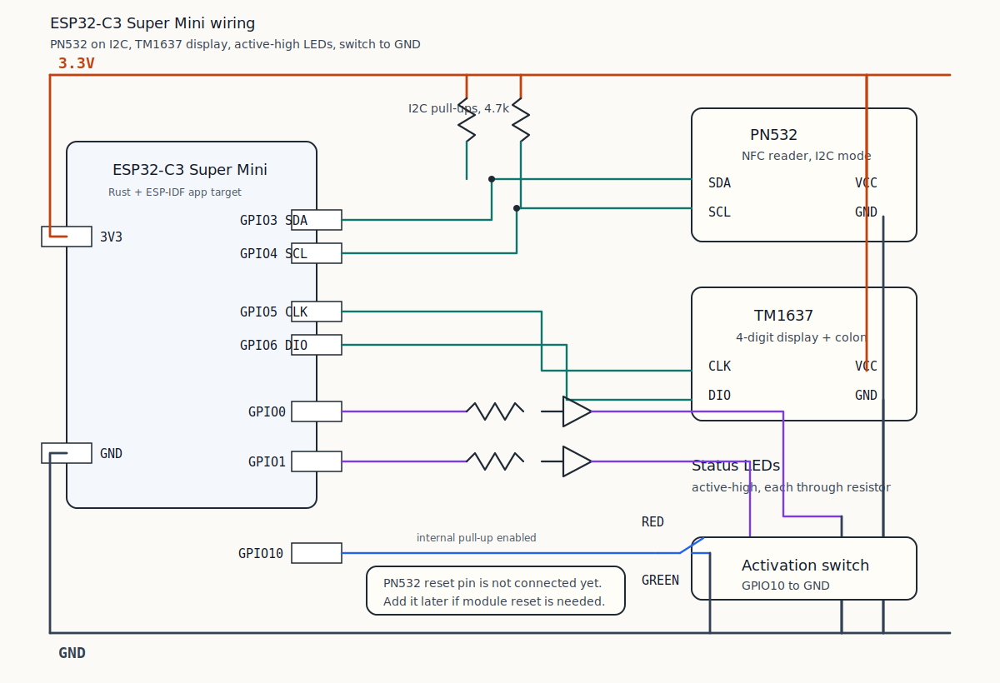

# Схема подключения

Документ описывает подключение текущей версии основного приложения `app` для
платы `ESP32-C3 Super Mini`.

## Общая схема



Это не breadboard-вид, а принципиальная схема подключения. Она лучше подходит
для документации, потому что явно показывает питание, землю, подтяжки I2C,
резисторы светодиодов и логику тумблера.

Для полноценного breadboard-вида лучше использовать отдельный инструмент:

- `Fritzing` — удобен именно для макетных плат и проводов “как на столе”.
- `KiCad` — лучше для нормальных принципиальных схем и последующей PCB.
- `Wokwi` — удобен для симуляции, но ESP32-C3 + конкретные PN532/TM1637-модули
  могут потребовать упрощённые модели.

## Таблица подключений

| Устройство | Контакт устройства | Контакт ESP32-C3 | Комментарий |
| --- | --- | --- | --- |
| `PN532` | `SDA` | `GPIO3` | I2C data |
| `PN532` | `SCL` | `GPIO4` | I2C clock |
| `PN532` | `VCC` | `3.3V` | Модуль должен поддерживать питание от 3.3V |
| `PN532` | `GND` | `GND` | Общая земля обязательна |
| `PN532` | `RSTO` / `RSTPD_N` | не подключён | Reset pin можно добавить позже отдельным GPIO |
| `TM1637` | `CLK` | `GPIO5` | Линия протокола TM1637 |
| `TM1637` | `DIO` | `GPIO6` | Линия протокола TM1637 |
| `TM1637` | `VCC` | `3.3V` | Используется питание 3.3V |
| `TM1637` | `GND` | `GND` | Общая земля обязательна |
| Красный LED | `anode` | `GPIO0` через резистор | Active-high |
| Красный LED | `cathode` | `GND` | Нужен токоограничивающий резистор |
| Зелёный LED | `anode` | `GPIO1` через резистор | Active-high |
| Зелёный LED | `cathode` | `GND` | Нужен токоограничивающий резистор |
| Тумблер | один контакт | `GPIO10` | В коде включён внутренний pull-up |
| Тумблер | второй контакт | `GND` | Замыкание на землю означает включённое состояние |
| On-board LED | встроен в плату | `GPIO8` | Обычно active-low, внешний провод не нужен |

## I2C pull-up

Для PN532 по I2C нужны внешние подтяжки:

| Линия | Подтяжка |
| --- | --- |
| `SDA` | `4.7k` к `3.3V` |
| `SCL` | `4.7k` к `3.3V` |

Внутренние pull-up ESP32-C3 слишком слабые для стабильного I2C. Если PN532
читает firmware version нестабильно, периодически теряет метки или зависает
после reset ESP32, pull-up и питание модуля нужно проверить в первую очередь.

## LED

Внешние светодиоды подключаются через токоограничивающий резистор. Типичный
диапазон для проверки на макетке: `220..1000 Ohm`.

Текущая логика ожидает active-high подключение:

```text
GPIO -> resistor -> LED anode
LED cathode -> GND
```

## Switch

Тумблер подключается между `GPIO10` и `GND`. В прошивке для входа включена
внутренняя подтяжка `Pull::Up`, поэтому логика такая:

| Состояние GPIO10 | Смысл для приложения |
| --- | --- |
| `High` | тумблер выключен |
| `Low` | тумблер включён |

## GPIO, которые лучше не трогать

На `ESP32-C3 Super Mini` есть пины, которые лучше не использовать без понимания
последствий:

| GPIO | Почему осторожно |
| --- | --- |
| `GPIO2` | strapping pin |
| `GPIO8` | strapping pin, часто on-board LED |
| `GPIO9` | strapping pin, часто BOOT |
| `GPIO12..17` | обычно линии SPI flash |
| `GPIO18/19` | USB D-/D+ |
| `GPIO20/21` | UART0 |
| `GPIO4..7` | могут пересекаться с JTAG |

Текущая схема использует `GPIO4..7` для PN532/TM1637, потому что это удобно для
макетной сборки. Если потребуется аппаратная JTAG-отладка, эти пины стоит
переназначить.
